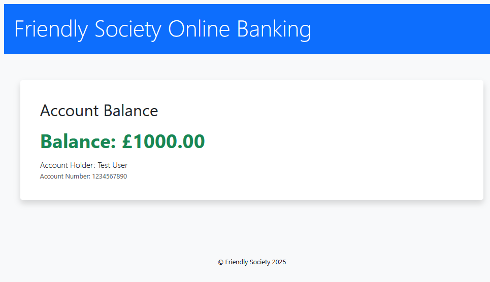

# Friendly Society Online Banking Demo

This project is a demonstration of agentic code development: all features and code were delivered by an AI agent following  coding standards and architectural guidelines. The purpose is to validate the ability of agentic, standards-driven development to deliver maintainable, secure, and production-quality features in a modern Java stack.

This is a demo online banking application for the 'Friendly Society', built with Java 21, Spring Boot 3, Vaadin, and Maven.

## Features
- Responsive Vaadin UI with Bootstrap styling
- View account balance for a simulated logged-in user
- Spring Boot REST API and service layer
- H2 in-memory database for easy development
- Separation of concerns: DTOs, ServiceImpl, Repository, Entity

## Getting Started

### Prerequisites
- Java 21
- Maven

### Running the Application
1. Clone the repository:
   ```bash
   git clone <your-repo-url>
   cd friendly-society
   ```
2. Build and run:
   ```bash
   ./mvnw spring-boot:run
   ```
3. Open your browser and go to [http://localhost:8080](http://localhost:8080). You will be redirected to the balance view.



## Coding Standards
See [`doc/CODE_STYLE.md`](doc/CODE_STYLE.md) for detailed coding guidelines. All code follows strict architectural and security best practices, and all features are delivered by the agent according to these standards.

## Development Notes
- The application auto-creates a demo account if it does not exist.
- The UI is responsive and styled with Bootstrap.
- For real authentication and more features, extend the current architecture as per the coding standards.

## License
This project is for demonstration and validation purposes only.
